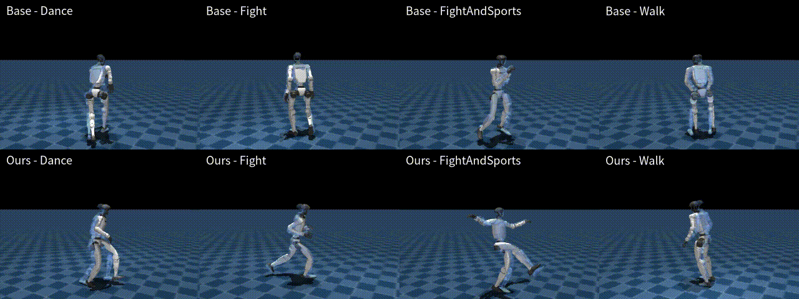

# ForgetMimic: Motion Unlearning for Reinforcement Learning Humanoid Control

[Xukun Luan](https://zili1000.github.io/)

**Selective forgetting of specific motions from a trained humanoid control policy.**

This repository is an unlearning framework. Given a trained policy that can perform multiple motions (walk, run, fight, dance, flips, etc.), our method selectively removes specific target motions while preserving all other motions.



### News

[2026.9.24] The preprint is now on arXiv. 

[2026.9.19] Our work is done! The code will be made open source soon.


### Cite
If you use our code in your work, please cite [our paper](https://arxiv.org/abs/2609.28378):
```bibtex
@misc{luan2026forgetmimicmotionunlearningreinforcement,
      title={ForgetMimic: Motion Unlearning for Reinforcement Learning Humanoid Control}, 
      author={Xukun Luan and Zhongxiang Lei and Chen Gong and Shaowei Li and Yuanguo Bi and Jinyan Liu},
      year={2026},
      eprint={2609.28378},
      archivePrefix={arXiv},
      primaryClass={cs.RO},
      url={https://arxiv.org/abs/2609.28378}, 
}
```
